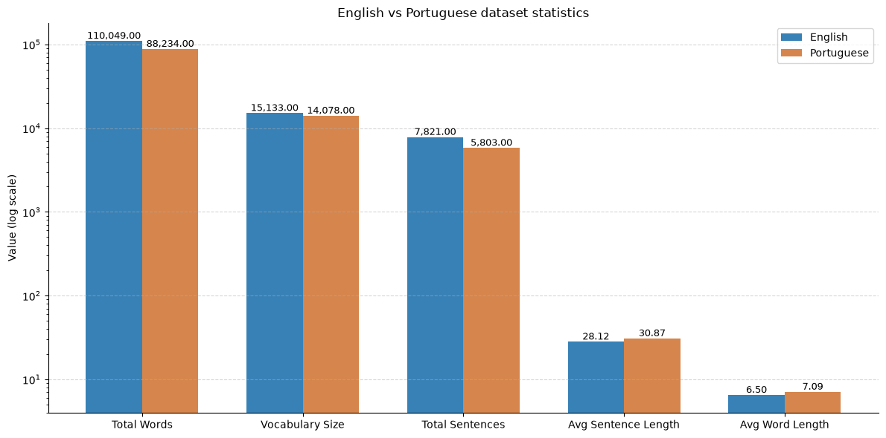
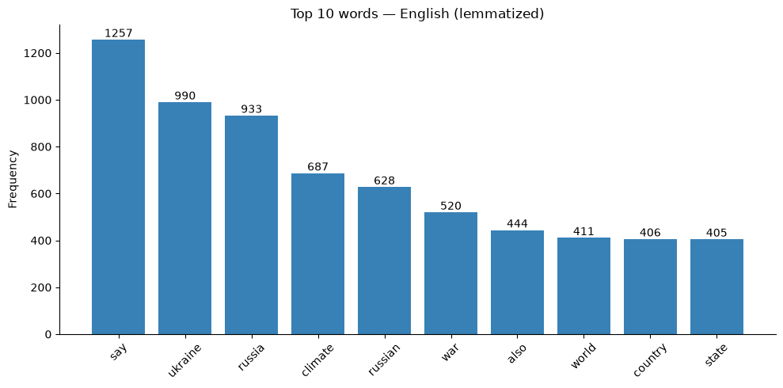
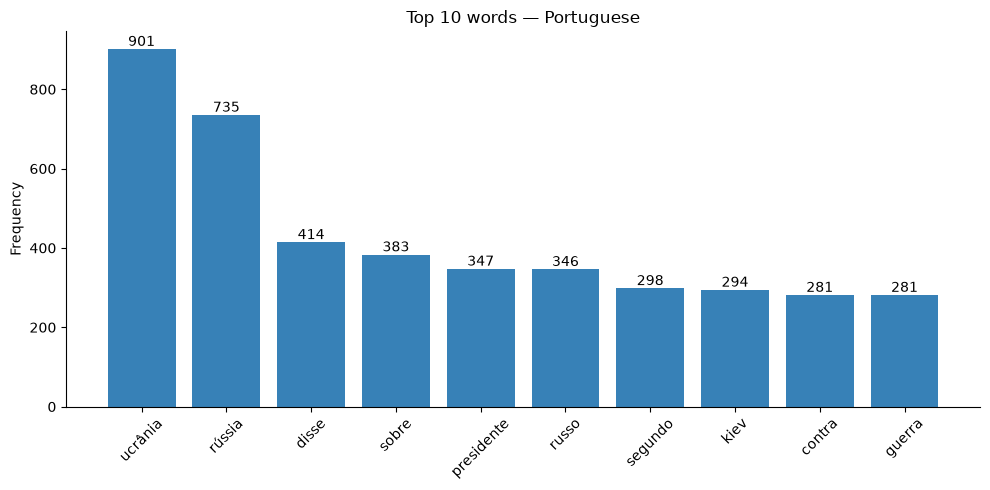
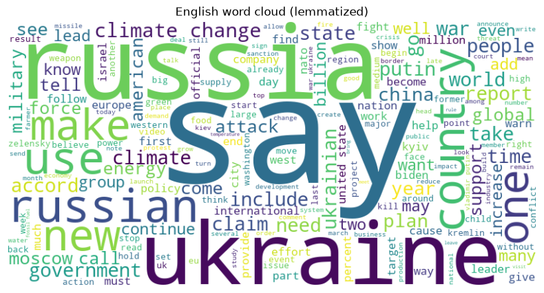
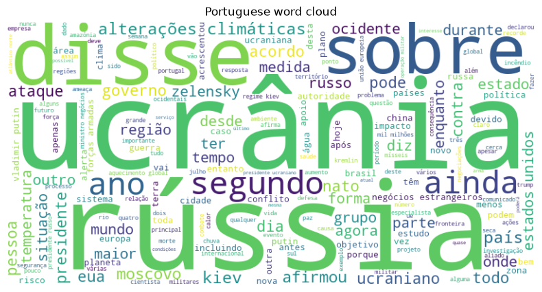

# 📰 Multilabel Narrative Classification with BERT


Multi-label classification of narratives in online news, built for [SemEval 2025 Task 10 (Subtask 2)](https://propaganda.math.unipd.it/semeval2025task10/). The system reads articles about the **Ukraine-Russia War (URW)** 🪖 and **Climate Change (CC)** 🌍 in **English** and **Portuguese**, and assigns each article one or more *narrative* labels plus fine-grained *subnarrative* labels, keeping both levels hierarchically consistent.

---

## ⚙️ How It Works

A fine-tuned `bert-base-multilingual-cased` encoder with two classification heads. The subnarrative head receives the narrative logits as extra input, so fine-grained predictions are conditioned on the coarse-level prediction:

```text
 news article (max 512 tokens)
        │
        ▼
┌───────────────────────┐
│     mBERT encoder     │
│    (pooled output)    │
└───────────┬───────────┘
            │
            ├────────────────► [ Narrative head ] ────► narrative labels
            │                         │ logits                │
            ▼                         ▼                       │
   concat(pooled output, narrative logits)                    │
            │                                                 │
            ▼                                                 ▼
   [ Subnarrative head ] ──► subnarrative labels ──► 🔗 consistency check
```

**Training** ⚖️ — focal loss (γ = 1.5, α = 0.5) with per-label `pos_weight`, oversampling via `WeightedRandomSampler`, random word-dropout augmentation (p = 0.05), and a consistency loss (weight 0.7) that pushes at least one subnarrative of every active narrative towards a high probability.

**Inference** 🎚️ — labels above the primary threshold (0.60 narrative / 0.75 subnarrative) are selected; if none qualify, the top label is forced. Then hierarchy is enforced: no narrative → subnarrative becomes `Other`; every predicted narrative gets a matching subnarrative or `Narrative: Other` is appended.

---

## 🗂️ Project Structure

| Path | Contents |
|---|---|
| 📓 [`notebook/`](notebook/) | Exploratory data analysis notebook |
| 🧠 [`src/training.py`](src/training.py) | Data prep, model and training loop |
| 🔮 [`src/inference.py`](src/inference.py) | Predictions → submission file |
| 📏 [`src/evaluation.py`](src/evaluation.py) | Sample & macro F1 metrics |
| ▶️ [`scripts/`](scripts/) | Wrappers — run from the project root |
| 📊 `screenshots/` | Charts used in this README |
| 📦 `data/` | SemEval releases *(not committed)* |
| 🤖 `models/` | Trained model *(created by training)* |
| 📤 `outputs/` | `submission.txt` + trainer logs |

Expected `data/` layout:

```text
data/
├── training_data_16_October_release/    # labelled training data
│   ├── EN/
│   │   ├── raw-documents/               # one .txt per article (200 files)
│   │   └── subtask-2-annotations.txt    # labels used in this project
│   └── PT/                              # same layout (200 files)
└── target_4_December_release/           # test articles: 399 EN + 400 PT
    ├── EN/
    └── PT/
```

**Annotation format** — `subtask-2-annotations.txt` is tab-separated (`article_id`, narratives, subnarratives); multiple labels are `;`-separated and subnarratives follow the `Narrative: Subnarrative` pattern:

```text
PT_13.txt	URW: Praise of Russia;URW: Discrediting Ukraine	URW: Praise of Russia: Praise of Russian military might;URW: Discrediting Ukraine: Discrediting Ukrainian military
```

The English training set has **21 narratives** and **71 subnarratives** (PT: 20 / 66), ~2 narrative labels per article on average.

---

## 🔬 Exploratory Data Analysis

[`notebook/dataset_analysis.ipynb`](notebook/dataset_analysis.ipynb) inventories the data folders, analyzes the label distribution (showing the class imbalance that motivated focal loss + oversampling), and computes corpus statistics per language: NLTK sentence/word tokenization → lowercasing → stopword removal → lemmatization for English (WordNet + POS tags; Portuguese keeps filtered surface forms).



The English corpus is larger, while Portuguese articles have longer sentences (30.9 vs 28.1 tokens) and longer words (7.1 vs 6.5 chars). The most frequent words directly reflect the two domains:

| English 🇬🇧 | Portuguese 🇵🇹 |
|---|---|
|  |  |
|  |  |

---

## 🚀 Getting Started

```bash
# 1. Setup
python -m venv .venv
.venv\Scripts\activate            # Windows  (Linux/Mac: source .venv/bin/activate)
pip install -r requirements.txt
# ...then place the two SemEval releases under data/ as shown above

# 2. Run the pipeline
python scripts/train.py           # 30 epochs, saves best model to models/final_model/
python scripts/infer.py           # writes outputs/submission.txt
python scripts/eval.py            # prints all five F1 metrics
```

GPU is optional (CUDA is used automatically). To switch language, set `LANG = "PT"` in the configuration block at the top of the three `src/` files.

---

## 🏆 Results

| Metric | English 🇬🇧 | Portuguese 🇵🇹 |
|---|---:|---:|
| Averaged Sample F1 — narrative:subnarrative pairs | **0.2988** | 0.1586 |
| Averaged Sample F1 — narrative only | **0.4831** | 0.3165 |
| Averaged Sample F1 — subnarrative only | **0.3068** | 0.2925 |
| Macro F1 — narrative only | **0.3844** | 0.2452 |
| Macro F1 — subnarrative only | **0.2056** | 0.1619 |

The hierarchical design captures broad narrative themes well; fine-grained subnarratives are harder due to label rarity, and Portuguese scores lower across the board.

---

## 🙌 Credits

Developed for the *Introduction to NLP* course project — **University of Bonn** 🎓
Implemented by **Tuseeq Ahmed Raza**.

Dataset: SemEval 2025 Task 10 — *Multilingual Characterization and Extraction of Narratives from Online News*.
